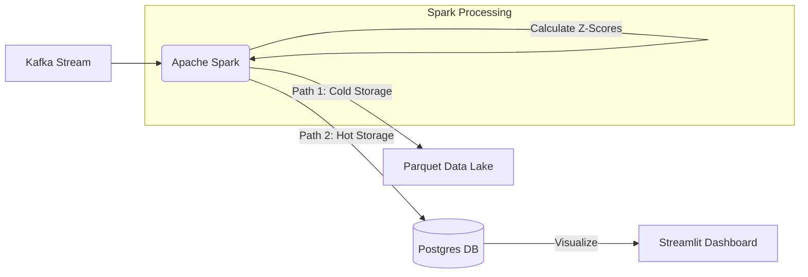

# Distributed Real-Time UPI Fraud Detection System

## Project Overview
This project is an **Event-Driven Big Data Pipeline** designed to detect financial fraud in high-throughput UPI transaction streams. 

Unlike traditional rule-based systems, this engine uses **Apache Spark Structured Streaming** to perform stateful, windowed aggregations in real-time. It calculates **Z-Scores** (Standard Deviation) to detect statistical anomalies and persists data into a **Partitioned Data Lake** for historical analysis.

##  System Architecture

## Dashboard Preview

